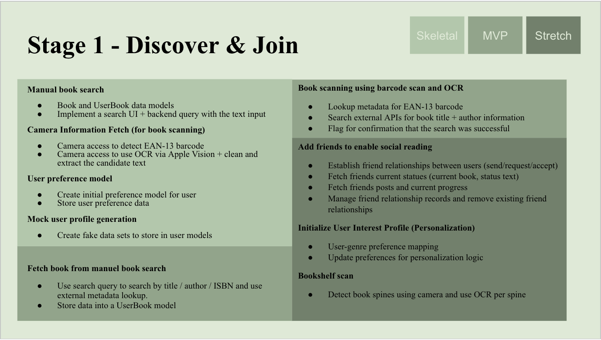
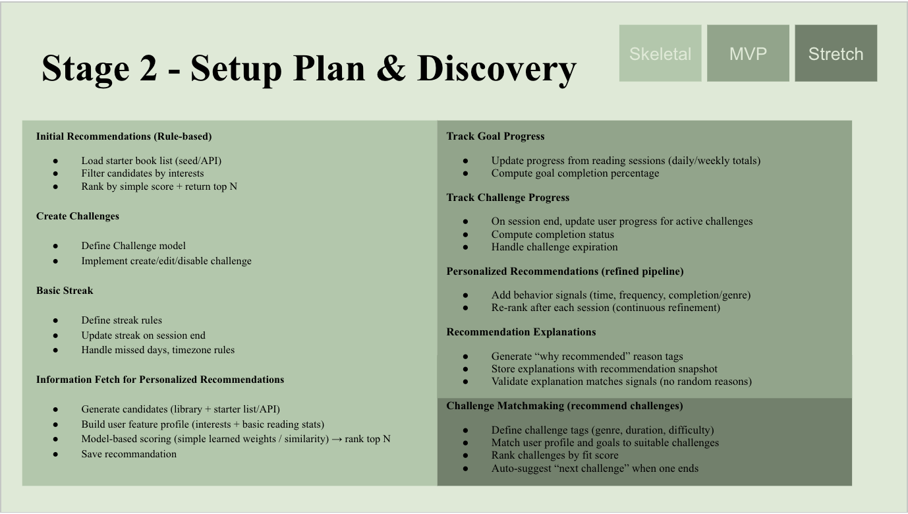
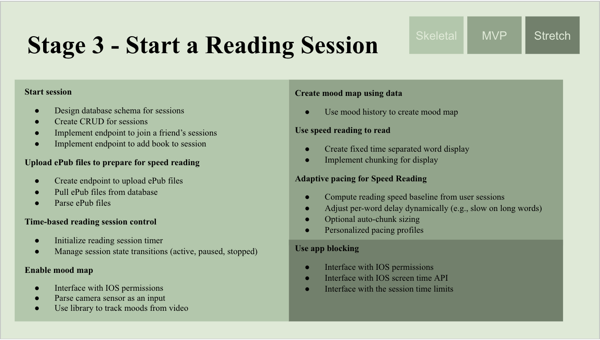
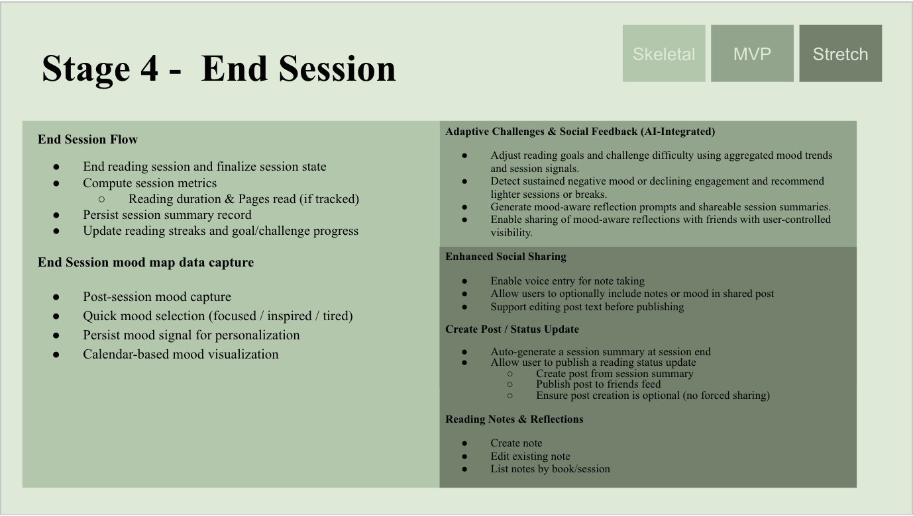
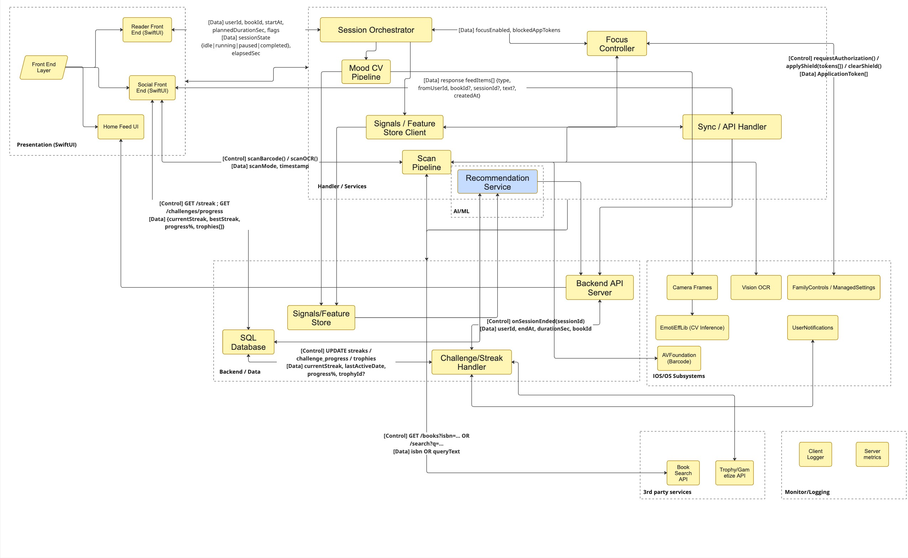

# Model and Engine

This document describes the KiwiFruit application architecture and design.

---

## Storymap

<table>
<tr>
<td width="50%">

</td>
<td width="50%">

</td>
</tr>
<tr>
<td width="50%">

</td>
<td width="50%">

</td>
</tr>
</table>

---

## Engine Architecture

---

## Model Engine

Model Engine in KiwiFruit is a multimodal recommendation module that generates personalized book suggestions for the Home Feed. It consumes heterogeneous signals produced by reading sessions, social activity, scanning behavior, and optional computer-vision mood summaries, then converts them into a unified feature representation for ranking. The goal is to provide recommendations that feel socially grounded and context aware, while keeping the computation lightweight enough for a student project.

The engine ingests signals through a dedicated Signals interface and storage. Session-related inputs include bookId, session duration, completion flags, interruptions, and timestamps. Social inputs include friend graph edges, friends' recent reads, likes and comments, and feed impressions. Scan inputs include ISBN codes, OCR title queries, source type, and confidence scores. Mood inputs come from the CV pipeline attached to a session and are represented as aggregated features such as average valence, volatility, and dominant emotion. These signals are stored as typed events, then periodically aggregated into a FeatureBundle keyed by userId.

At inference time, the Model Engine retrieves the latest FeatureBundle and produces a ranked list of candidate books. Candidates are drawn from a small pool composed of friends' books, books similar to the user's library, and books surfaced by recent scan intent. Ranking uses a transparent scoring function where each modality contributes a weighted term, with normalization to keep any single source from dominating. The output is a list of recommendedBooks containing bookId, score, and reasonTags that explain the main drivers such as friends_reading, similar_genre, recent_scan_intent, and high_focus_sessions.

The engine interfaces with the app through a single recommendation API, typically GET /recommendations, and optionally a background refresh path that writes cached results for fast Home loads. Monitoring is done at both client and server boundaries: request latency and error rate on the endpoint, feature freshness for the FeatureBundle, and engagement metrics such as impressions and clicks on recommended items. These metrics validate that the pipeline is producing stable outputs and that each modality is contributing useful signal.

---

*Last Updated: February 12, 2026*  
*Team: Team Kiwifruit*
